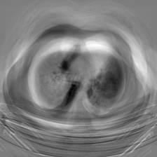

# 胸腔 CT 图像二分类问题

`R` `PCA` `Logistic` `Python` `PyTorch` `CNN`

> 数据集来自 Kaggle 的仓库 [CT-Images](https://www.kaggle.com/datasets/seifelmedany/ct-images)

**概述**

CT-Images 数据集包括 $1500$ 张正常胸腔 CT 截面图，$1500$ 张患癌胸腔 CT 截面图。项目目标是实现“正常-患癌”二分类问题，并对 CT 图片进行特征提取，以期获得更精确的医学诊断和解释，为以后的研究提供统计推断的依据。主要使用的方法包括：主成分分析法（PCA）、Logistic 回归、聚类分析、卷积神经网络。其中主成分分析用于图像降维（作为拓展，尝试使用 MaxPool 最大池化方法进行降维），聚类分析用于初步分析，Logistic 回归用于二分类，卷积神经用于更为精细的二分类。

## 1 数据描述

拟研究的问题：CI-Images 肺部 CT 图的“正常-患癌”二分类问题。CT-Images 数据集包括 $1500$ 张正常肺部 CT 图，$1500$ 张患癌肺部 CT 图。分别存储于文件夹 [data/normal/](data/CT/normal) 和 [data/cancer](data/CT/cancer) 中（数据平衡性满足）。

其中每一个 CT 图已经过处理，为 `.jpg` 格式，具有 RGB 三通道。但都经过了黑白化处理，可以转换为 `.png` 单通道格式读入程序（tips: 图片像素点在处理后值仅为 $0$ 和 $1$）。可见附录例图：[正常](#a1) 与 [患癌](#a2) 。

## 2 图像处理

图像数据可以理解为一个 $3$ 维张量，分别为 $(H,\ W,\ C)$ 其中 $H,\ W$ 分别表示图片的长和宽，而 $C$ 代表了图片的通道数（例如 $C = 1$ 则为单通道灰度图，$C = 3$ 则为常见的 RGB 三通道图片）。

在本项目中，我们先读取图片，得到 $H \times W \times C$ 的张量，经处理得到灰度图，即为 $H \times W$ 的矩阵，每个元素的数值代表像素值。将图片矩阵展平，得到一个图片向量 $v \in \mathbb{R}^{HW}$ 。本项目将图片统一为 $p = 224 \times 224$ 维度的向量 $v \in \mathbb{R}^p$ 。

如此将 $n$ 个样本读入程序，按行合并成为一个样本矩阵 $X \in \mathbb{R}^{n \times p}$ 其中每一行代表一个图像样本向量，每一列代表某一位置的像素值。

## 3 数据降维：PCA 主成分分析 & 池化

### 3.1 PCA 主成分分析

由于原来的样本数据向量 $x \in \mathbb{R}^p,\quad p = 224\times 224 = 50176$ ，特征维度过高，难以进行分析和建模，故可以采用 **主成分分析 PCA** 方法进行降维。前 10 个主成分特征图见 [附录 B](#b1) 。

---

主成分分析（Principal Component Analysis, PCA）由 Hotelling 于 1933 年首先提出 [[1]](#ref1) 。 目的是把多个变量压缩为少数几个综合指标（称为主成分），使得综合指标能够包含原来的多个变量的主要的信息。下面以总体主成分为例，进行算法推导：

对于我们这个问题的每一个样本，在被抽样前均为随机变量 $\widetilde{X} \in \mathbb{R}^p$ ，设其协方差存在且为 $\Sigma \in \mathbb{R}^{p \times p}$ ，对协方差进行谱分解得到：

```math
\Sigma = P \Lambda P^T
```

其中 $P \in \mathbb{R}^{p\times p}$ 为正交阵，而 $\Lambda \in \mathbb{R}^{p \times p}$ 为对角阵，且对角元素为 $\Sigma$ 的特征值，即 $\Lambda = diag(\lambda_1,\ \lambda_2,\ \cdots,\ \lambda_p)$ ，且特证值按降序排列 $\lambda_{i} \geq \lambda_{i+1}$ 。设 $p_j$ 为第 $j$ 个的特征向量，即 $P$ 的第 $j$ 列。则有 $\widetilde{X}$ 的第 $j$ 个主成分：

```math
Y_j = p_j^T \widetilde{X}
```

记 $Y = \left[Y_1,\ Y_2,\ \cdots,\ Y_p\right] = P^T \widetilde{X} \in \mathbb{R}^p$ ，则有：

```math
Cov(Y) = Cov(P^T X) = P^T Cov(\widetilde{X}) P = P^T \Sigma P = P^TP\Lambda P^TP = \Lambda
```

如上构造的主成分 $Y_j$ 为 $\widetilde{X}$ 的线性组合，且满足在 $Y_j \perp Y_k,\quad k = 1,\ 2,\ \cdots,\ j-1$  使得 $Var(Y_j)$ 最大的线性组合，直观地理解就是 $\widetilde{X}$ 在 $Y_j$ 方向上被尽可能的分开（方差尽可能大）。

在本问题中，为实现降维，可以选择这 $p$ 个主成分的前 $q$ 个，即由原来样本 $x \in \mathbb{R}^p$ 降低到 $x' \in \mathbb{R}^q$ 。但这仍然存在问题，即数据维度 $p = 50176$ 远远大于样本量 $n = 3000$ ，同时我们也无法获得一个五万级别大小的矩阵的谱分解，所以下面提出一种更新的方法，借由矩阵 **奇异值分解（SVD 分解）**的思想计算。

---

如果我们已经获取到了样本信息，构造出了样本矩阵 $X \in \mathbb{R}^{n\times p}$ ，假设 $X$ 已经中心化，即 $\bar{X} = \bf{0} \in \mathbb{R}^p$ 。我们的目标是找到一组正交的向量 $v_1,\ v_2,\ \cdots,\ v_p \in \mathbb{R}^p$，将数据投影到这些方向上后，使得投影后的数据具有最大的方差，即：

```math
\max_{v_j \perp v_1,\ v_2,\ \cdots,\ v_{j-1}} Var(Xv_j) = \frac{1}{n} \frac{\|Xv_j\|^2}{\|v_j\|^2} = \frac{1}{n} \frac{v_j^T X^T X v_j}{v_j^Tv_j}
```

由 <u>引理 1</u> ：正定阵 $A$ 第 $j$ 个特征值和特征向量为 $(\lambda_i,\ e_i),\quad \lambda_i \geq \lambda_{i+1}$ 则有

```math
\max_{x \perp e_1,\ e_2,\ \cdots,\ e_{j-1}} \frac{x^TAx}{x^Tx} = \lambda_j,\quad \text{when}\ \ x = e_{k}
```

可知原问题最优解 $v_j^*$ 为 $X^TX$ 的第 $j$ 个特征向量。于是我们对 $X$ 进行 SVD 分解：

```math
X = U \Lambda V^T
```

其中 $U \in \mathbb{R}^{n\times n},\ V \in \mathbb{R}^{p \times p}$ 且满足 $UU^T = I_n,\ VV^T = I_p$ 。而 $\Lambda \in \mathbb{R}^{n \times p}$ 为对角矩阵，主对角线为降序排列的奇异值，其他位置为零。注意到：

```math
X^TX = V\Lambda^T U^TU\Lambda V^T = V\Lambda^T \Lambda V^T
```

注意到 $X^TX,\ \Lambda^T\Lambda,\ V \in \mathbb{R}^{p\times p}$ ，完全符合谱分解的形式，故 $V$ 的每一列均为 $X^TX$ 的特征向量，即这里的 $V$ 的每一列就是我们要找的最优 $v_j^*$ ，下面介绍如何更高效的求解 $X^TX$ 的特征向量。

若记 $u \in \mathbb{R}^n$ 为 $XX^T \in \mathbb{R}^{n\times n}$ 的特征向量，特征值为 $w$ ，则有 $XX^T u = wu$ ，左乘 $X^T$ 有：

```math
X^TXX^Tu = (X^TX) \cdot X^Tu = X^T wu = w \cdot (X^Tu)
```

故有 $X^Tu$ 为 $X^TX$ 的特征向量。所以我们可以通过求解 $XX^T$ 的特征向量 $u$ 进而推出 $X^TX$ 的特征向量 $v = X^Tu$ 。需要注意的是，$XX^T \in \mathbb{R}^{n \times n}$ 维度为 $n$ ，当样本量远小于特征量 $p$ 时（例如本问题），采用这个方法能极大的提高计算效率。同样地，为了降维，我们只需选取 $XX^T$ 的前 $q$ 个特征向量即可。

---

虽然上面的方法已经极大地节约了计算成本，但当遇见 $n$ 样本量同样巨大的问题（例如本问题），求解 $XX^T \in \mathbb{R}^{n \times n}$ 的特征向量仍然十分困难。而且，出于降维的目的，我们不需要所有的 $n$ 个特征向量，而只需要前 $q$ 大的特征值对应的特征向量，所以可以采用近似的方法，只计算前 $q$ 个特征向量。所以可以对 $X$ 进行**截断奇异值分解**：设 $X \in \mathbb{R}^{n \times p}$ 的秩 $rank(X) = r > q$ ，则 $X$ 的截断奇异值分解为：

```math
X \approx U_q \Lambda_q V_q^T
```

其中 $U_q \in \mathbb{R}^{n \times q},\ V_q \in \mathbb{R}^{p \times q}$ 由 $U,\ V$ 的前 $q$ 列组成，而 $\Lambda_q \in \mathbb{R}^{q \times q}$ 为对角矩阵，由 $\Lambda$ 前 $q$ 个对角元素组成。

为了实现这个目标，G Golub, W Kahan 于 1965 年提出了 Golub-Kahan 双对角分解法 [[2]](#ref2) 用于求解 SVD 分解问题。而 J Baglama, L Reichel 于 2005 年进一步提出了 IRLBA 算法 [[3]](#ref3) 用于高效解决奇异值近似问题。

### 3.2 MaxPooling 最大池化

除了使用主成分分析法，在计算机视觉中 **池化 Polling** 也是常见的图像降维、图像压缩方法。池化的概念最早由 LeCun (et al. 2002) 在 `LeNet` 网络中提出 [[4]](#ref4) ，常见的池化操作有均值池化、最大池化 (Krizhevsky A, Sutskever I, Hinton G E, et al. 2012 在 AlexNet 网络中使用 [[5]](#ref5) ) ，本项目采用最大池化尝试进行降维。

池化操作可以简单理解为使用一个固定大小的窗口，按顺序在原始图片上进行“扫描”并计算得到新图片的过程，图片大小变化公式为：假设原始图片大小为 $H_\text{in} \times W_{\text{in}}$ ，以高为例（宽同理）：

```math
H_\text{out} = \left\lfloor \frac{H_\text{in} + 2P -D \cdot (K - 1) - 1}{S} + 1 \right\rfloor
```

| 符号 | 名称        | 作用                                                         |
| ---- | ----------- | ------------------------------------------------------------ |
| $K$  | Kernel size | 池化窗口大小 $K \times K$                                    |
| $S$  | Stride      | 每次窗口移动的步长，默认与 $K$ 相同                          |
| $P$  | Padding     | 是否在边缘补 $0$ ，默认为 $0$ 即不补充                       |
| $D$  | Dilation    | 膨胀系数，即在一个池化窗口中被选取的像素相隔 $D-1$ 个单元，默认为 $1$ |

在本项目中，按照 $224 \times 224$ 的固定大小读取 CT 图片，然后选取池化窗口 $K = 4$ 其他默认，使用最大池化，即在一个窗口选取最大像素作为值。根据公式，得到池化后的图片大小为 $56 \times 56$ 。


## 4 初步分析：聚类分析

对于分类问题，一个简单的想法就是通过 **聚类分析**。我们使用 `R` 语言的 `cluster` 包，使用 `K-Means` 算法，对所有数据（$3000$ 张图片）进行降维后 $x \in \mathbb{R}^q$ ，再进行二分类的聚类分析。

对于样本 $x_i \in \mathbb{R}^q,\quad i=1,\ 2,\ \cdots,\ n$ 我们需要将其分为 $C_1,\ C_2,\ \cdots,\ C_k$ 类，使得簇内平方和误差最小：

```math
\min\limits_{C_1,\ C_2,\ \cdots,\ C_k}\sum\limits_{j=1}^k \sum\limits_{x_i \in C_j} \|x_i - \mu_j \|^2
```

其中 $\mu_j$ 为 $C_j$ 的簇内均值：$\mu_j = \sum_{x_i \in C_j}x_i \left/ |C_j|\right.$ 。注意到，聚类分析采用”距离“作为分类标准，没有参数需要估计，且为无监督学习，即没有用到标签值的信息，结果不会太好。经计算，准确率为 $63.57$ % 。

## 5 二分类问题

### 5.1 Logistic 回归

对于经过降维之后的数据向量 $x \in \mathbb{R}^q$ ，采用 **Logistic 回归** 的方式进行二分类，标签为 `normal` 和 `cancer` ，从样本的 normal 和 cancer 中分别随机抽取 $1000$ 张图片，总共 $2000$ 张图片进行训练，对于剩下的 $500$ 张 normal 和 $500$ 张 cancer 数据作为测试集，用于检查模型的准确率。

对于 Logistic 回归模型，需要估计的参数为 $\beta \in \mathbb{R}^{q+1}$ ，记 $p = P(\text{cancer})$ 为患癌概率，在原始数据 $X$ 的第一列前增加一列全 $1$ 向量 $\bf{1} \in \mathbb{R}^n$ ，即有 $X = \left[\bf{1}\quad X \right]\in \mathbb{R}^{n\times (q+1)}$ ，于是有模型：

```math
\log \frac{p}{1-p} = X\cdot \beta
```

使用数值方法估计参数 $\beta$ ，需要估计的参数量为 $q+1$ 个。

模型参数的估计：对于已有的训练集 $T = \{ (x_1,\ y_1),\ (x_2,\ y_2),\ \cdots,\ (x_n,\ y_n) \}$ 其中 $x_i \in \mathbb{R}^{q+1},\ y_i \in \{ 0,\ 1 \}$ 于是有：

```math
P(Y=1|x) = \pi(x) = \frac{\exp(x^T\beta)}{1+\exp(x^T\beta)}
```

```math
P(Y=0|x) = 1-\pi(x) = 1-\frac{\exp(x^T\beta)}{1+\exp(x^T\beta)}
```

通过极大化对数似然函数的方法，估计参数 $\beta$ ：

```math
\max\limits_{\beta \in \mathbb{R}^{q+1}}\ L(\beta) = \sum\limits_{i=1}^n\ [ y_i\cdot \log \pi(x_i) + (1-y_i)\cdot \log (1- \pi(x_i) ]
```

在本项目中，选择 $q = 10$ ，经过计算，得到结果见 [附录 C](#c1) 。

模型解释：对于变量/主成分 $PC_i$ ，每增加一个单位，患癌事件 cancer 的 `odds` 就会扩大/缩小 $e^{\beta_i}$ 倍。

测试集检查：在剩下的 $1000$ 张图片中进行预测，总体准确度达到了 $76.00$ % ，混淆矩阵见 [附录 C](#c2) 。

### 5.2 LASSO 回归

直接使用 PCA ，若保留的主成分过多会带来计算复杂，若选取太少则会导致结果不佳。所以，接下来我们采用 **Logistic + LASSO** 的方式进行间接变量选择。

LASSO 回归 (Robert Tibshirani 1996. [[6]](#ref6)) ：在回归参数估计时，加入 **L1 范数**作为惩罚项。即对于本项目的 Logistic 回归的参数估计，需要优化的式子为：

```math
\min\limits_{\beta \in \mathbb{R}^{q'+1},\ \lambda \in \mathbb{R}^+}\ L(\beta) = -\frac{1}{n} \sum\limits_{i=1}^n\ [ y_i\cdot \log \pi(x_i) + (1-y_i)\cdot \log (1- \pi(x_i) ] + \lambda \| \beta \|_1
```

其中 $\| \beta \|_1 = \sum_{j=1}^{q'+1} |\beta_j|$ 为向量 $\beta$ 的 L1 范数（若采用 L2 范数，即 $\| \beta \|_2 = \sum_{j=1}^{q'+1} \beta^2_j$ ，则是岭回归 Ridge Regression）。此时需要估计的参数数量为 $q'+1+1 = q'+2$ 。

先使用 MaxPooling 进行降维，故 $q' = 56 \times 56 = 3136$ ，于是本模型需要估计的参数数量为 $3138$ 个。

根据 LASSO 回归选取的变量，我们构造特征图，见 [附录 D ](#d1) 。

## 6 拓展：卷积神经网络 CNN

使用**卷积神经网络 CNN** 可以进一步提高预测的准确率，本项目实现了 2 个神经网络用于展示 `ShallowCNNModel` 和 `CNNModel` ，实现代码位于 [cnn.py](models/cnn.py) 文件中。其中 `ShallowCNNModel` 网络架构以及训练预测主程序框架来自 Kaggle 开源代码 [lung-Ctscan](https://www.kaggle.com/code/saikrishnakowshik/lung-ctscan) 。`CNNModel` 是本项目实现的更深的卷积神经，预测效果更好 (基于 AlexNet 网络框架) 。

训练和预测日志可见 [logs](logs) 文件夹，其中 [logs_shallow.txt](logs/logs_shallow.txt) 为 lung-Ctscan 模型的日志， [logs.txt](logs/logs.txt) 为本项目模型的日志。 [checkpoints](checkpoints) 文件夹存储了训练后的模型参数，因为参数文件较大，故不上传。模型均在 Kaggle 提供的 GPU 环境下进行训练，最优结果如下所示。

> 因为 `CNNModel` 参数过多，可能导致过拟合的问题，当过拟合时结果为：Train Acu = $96.67$ % ，Val Acu = $96.22$ % ，Test Acu = $94.22$ % 。

| Model             | Train Loss | Train Acu | Val Loss | Val Acu   | Test Loss | Test Acu  |
| ----------------- | ---------- | --------- | -------- | --------- | --------- | --------- |
| `ShallowCNNModel` | $0.6076$   | $94.52$ % | $0.1507$ | $93.33$ % | $0.1240$  | $94.89$ % |
| `CNNModel`        | $0.3526$   | $97.52$ % | $0.1293$ | $95.11$ % | $0.0835$  | $96.67$ % |

> 可执行的 Notebook 代码已开源在 Kaggle ，链接 [CT-Images-CNN](https://www.kaggle.com/code/iskage/ct-images-cnn/) ，可使用 Kaggle 或 Colab 提供的 GPU 平台进行训练。

## 7 总结

本项目完成了对胸腔截面 CT 医学图像进行二分类的任务：

- 使用主成分分析 (PCA) 和最大池化 (MaxPooling) 对图像进行特征提取和降维处理。
- 若采用简单的聚类分析，分类准确率为 $63.57$ % 。
- 利用 Logistic 模型作为分类器，实现对数据集的二分类任务，最终测试集准确率达到 $76.00$ %。
- 为了在尽可能不损失信息和计算高效权衡，使用 MaxPooling 初步降维，然后使用 LASSO 回归辅助 Logistic 回归筛选变量，得到最终模型，测试集准确率高达 $98.17$ % 。

> 拓展：使用卷积神经网络进行分类，测试集准确率大约为 $94.22$ % 到 $96.67$ % 。

## 参考文献

[1] [Hotelling H. Analysis of a complex of statistical variables into principal components[J]. Journal of educational psychology, 1933, 24(6): 417.](https://psycnet.apa.org/record/1934-00645-001) <a id="ref1"></a>

[2] [Golub G, Kahan W. Calculating the singular values and pseudo-inverse of a matrix[J]. Journal of the Society for Industrial and Applied Mathematics, Series B: Numerical Analysis, 1965, 2(2): 205-224.](https://epubs.siam.org/doi/abs/10.1137/0702016) <a id="ref2"></a>

[3] [Baglama J, Reichel L. Augmented implicitly restarted Lanczos bidiagonalization methods[J]. SIAM Journal on Scientific Computing, 2005, 27(1): 19-42.](https://epubs.siam.org/doi/abs/10.1137/04060593X) <a id="ref3"></a>

[4] [LeCun Y, Bottou L, Bengio Y, et al. Gradient-based learning applied to document recognition[J]. Proceedings of the IEEE, 2002, 86(11): 2278-2324.](https://ieeexplore.ieee.org/abstract/document/726791/) <a id="ref4"></a>

[5] [Krizhevsky A, Sutskever I, Hinton G E. Imagenet classification with deep convolutional neural networks[J]. Advances in neural information processing systems, 2012, 25.](https://proceedings.neurips.cc/paper/2012/hash/c399862d3b9d6b76c8436e924a68c45b-Abstract.html) <a id="ref5"></a>

[6] [Tibshirani R. Regression shrinkage and selection via the lasso[J]. Journal of the Royal Statistical Society Series B: Statistical Methodology, 1996, 58(1): 267-288.](https://academic.oup.com/jrsssb/article/58/1/267/7027929) <a id="ref6"></a>

## 附录

### A 例图

未患癌的正常胸腔 CT 扫描图<a id="a1"></a>


患癌个体的胸腔 CT 扫描图<a id="a2"></a>


### B PCA 特征图

前 10 主成分特征图：<a id="b1"></a>




### C Logistic 结果

Logistic 回归结果：<a id="c1"></a>

```R
Call:
glm(formula = cancer ~ PC1 + PC2 + PC3 + PC4 + PC5 + PC6 + PC7 + 
    PC8 + PC9 + PC10, family = binomial(), data = data)

Coefficients:
             Estimate Std. Error z value Pr(>|z|)    
(Intercept) -0.010565   0.055126  -0.192 0.848015    
PC1          0.013860   0.001733   7.999 1.25e-15 ***
PC2         -0.020969   0.002185  -9.598  < 2e-16 ***
PC3         -0.014640   0.002798  -5.233 1.67e-07 ***
PC4          0.005460   0.002847   1.918 0.055143 .  
PC5          0.036270   0.003616  10.029  < 2e-16 ***
PC6         -0.018562   0.003679  -5.046 4.52e-07 ***
PC7          0.028268   0.004190   6.746 1.52e-11 ***
PC8          0.034457   0.004875   7.068 1.58e-12 ***
PC9         -0.018465   0.005223  -3.535 0.000408 ***
PC10        -0.090350   0.005876 -15.377  < 2e-16 ***
---
Signif. codes:  0 ‘***’ 0.001 ‘**’ 0.01 ‘*’ 0.05 ‘.’ 0.1 ‘ ’ 1

(Dispersion parameter for binomial family taken to be 1)

    Null deviance: 2772.6  on 1999  degrees of freedom
Residual deviance: 2037.0  on 1989  degrees of freedom
AIC: 2059

Number of Fisher Scoring iterations: 4
```

混淆矩阵：<a id="c2"></a>

```R
         y_test
pred_test  0  1
        0 75 23
        1 25 77
```

### D LASSO 特征图

经过 LASSO 回归挑选的重要变量构成的特征图：<a id="d1"></a>

- 压缩后的 $56 \times 56$ 的特征图


- 反池化的 $224 \times 224$ 特征图

